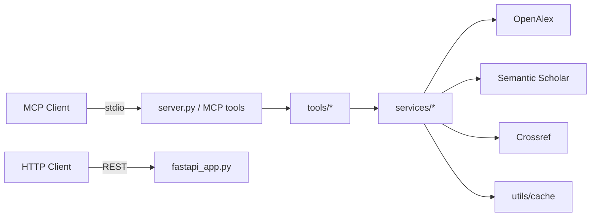
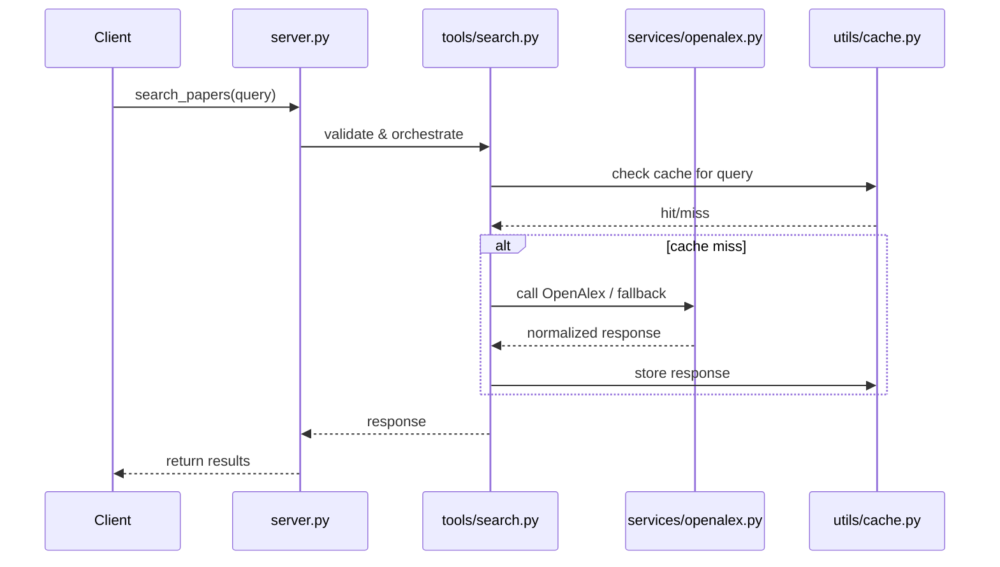

# Architecture — Journal Search MCP Server

This file documents the system architecture and major components. It is grounded in the source files at the repository root.

## High-level architecture

- Client layer: MCP clients (stdio) or HTTP REST clients
- FastAPI REST layer: `fastapi_app.py` (serves HTTP API for non-MCP clients)
- MCP tools layer: `tools/*.py` (validate inputs, orchestrate service calls)
- Service clients: `services/*.py` (OpenAlex, Semantic Scholar, Crossref)
- Cache layer: `utils/cache.py` (SQLite cache)
- Utilities: `utils/http_client.py`, `utils/logger.py`, `utils/exceptions.py`

## Component diagram (Mermaid)

## Sequence (Search request)

## Notes
- The FastAPI layer shares services and cache so both MCP and HTTP interfaces remain consistent.
- The SQLite cache is intentionally simple and local — it's a performance and rate-limit mitigation, not a canonical datastore.
