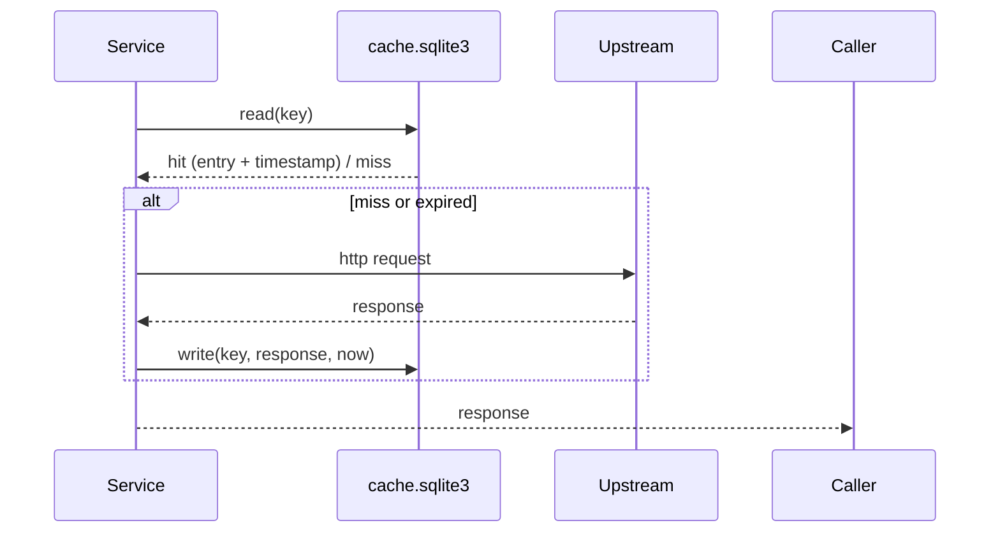

# Database Cache — SQLite (runtime cache)

The repository uses a lightweight SQLite file as a local response cache. The cache is intended to reduce upstream API calls, improve latency, and respect provider rate limits. It is not a primary datastore and the runtime location is configurable.

Key points
- Location: by default the runtime cache file is `/data/cache.sqlite3` inside the container. This avoids permission issues when the repository is bind-mounted into `/app`.
- Why SQLite: Zero-ops local file database that is portable, transactional, and easy to inspect.
- Cache keys: Typically a hash of service name + endpoint + serialized request parameters. Implementations live in `utils/cache.py`.
- TTL: The cache TTL is configurable via environment variables (see `config.py` / `.env.example`). On cache miss or TTL expiry the service will fetch fresh data and update the cache.
- Serialization: Responses are serialized to JSON for storage. Binary data is not stored.
- Expiration: `utils/cache.py` enforces TTL on reads; expired entries are treated as misses.

Cache lifecycle (Mermaid)

Notes
- Use the accompanying command-line or tests to inspect cache contents. The file is a standard SQLite DB and can be opened with sqlite3.
- This cache reduces the number of identical requests to OpenAlex/Semantic Scholar/Crossref and therefore reduces the chance of hitting rate limits.
